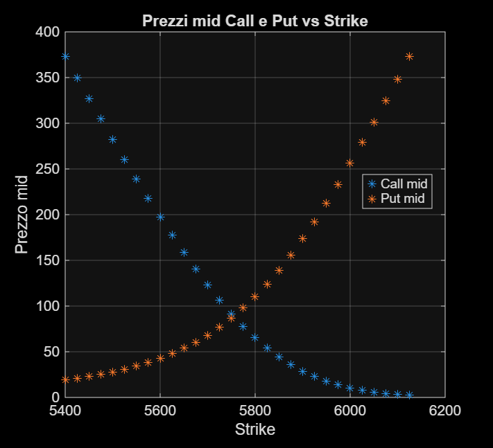
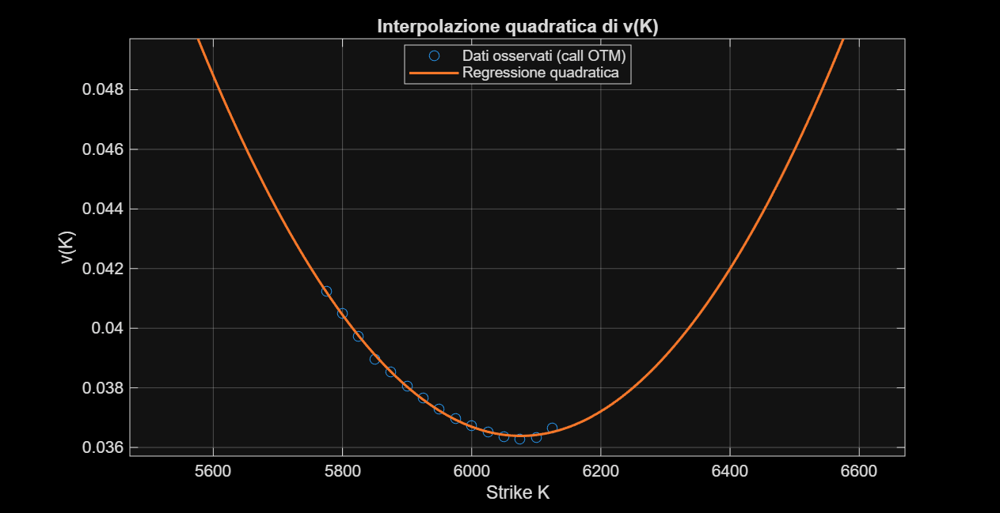
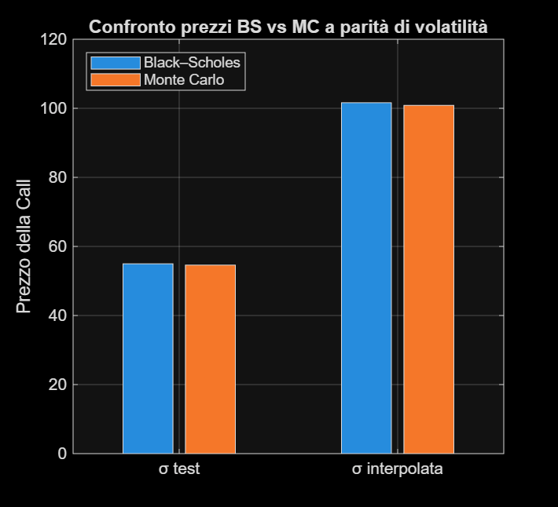
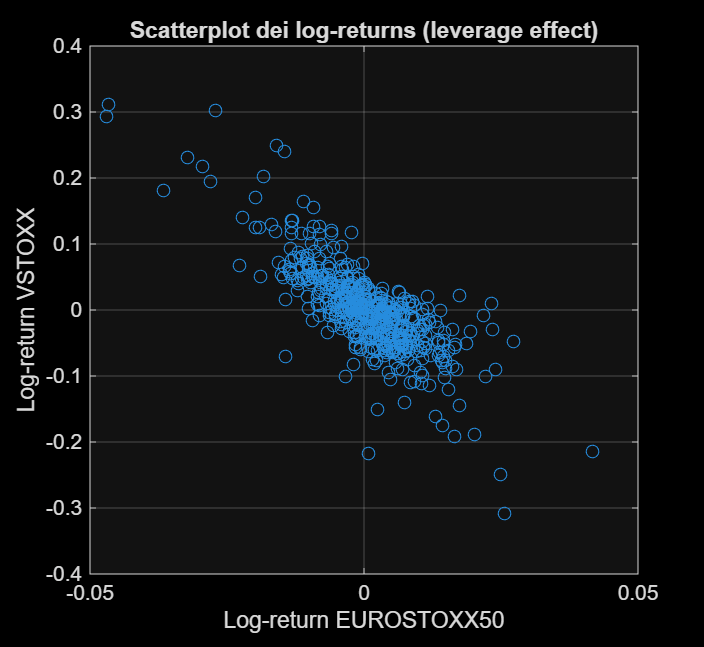
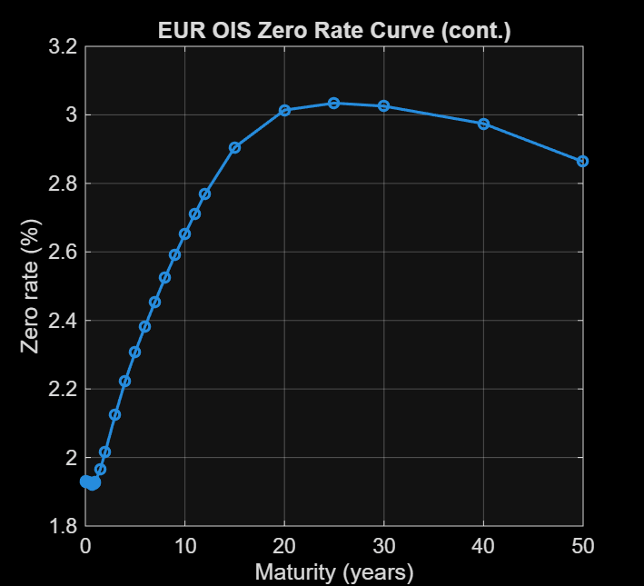
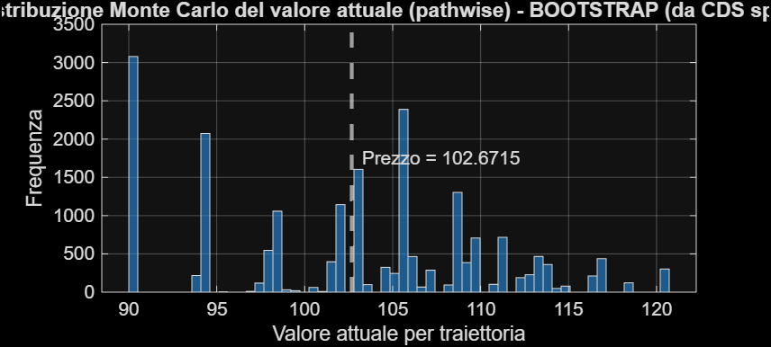

# Advanced Derivatives Market Analysis

Group coursework in **MATLAB** built around EURO STOXX 50 options, VSTOXX, EUR OIS rates and Crédit Agricole credit data. The assignment moves from static option checks and vanilla pricing to volatility, curve construction and a callable credit-equity-linked bond.

The MATLAB files are the submitted group code. Bloomberg-derived workbooks and Terminal screenshots are not redistributed.

## What the assignment covers

1. **Option no-arbitrage checks** — Merton lower bounds, monotonicity and discrete convexity on bid/ask mid prices, with bid-ask-based tolerances used as an empirical check.
2. **Implied volatility and Black-Scholes** — a quadratic fit to total implied volatility and pricing of the target call.
3. **Monte Carlo pricing** — 20,000-path European-call valuation with a 95% confidence interval and Black-Scholes comparisons.
4. **One-maturity VSTOXX exercise** — OTM-option aggregation using the simplified single-maturity formula requested in class.
5. **EURO STOXX 50 / VSTOXX dependence** — log-return scatterplot, correlation and an OLS exercise written in Vasicek/Euler form.
6. **Euribor distribution fitting** — empirical changes/log-changes compared with Normal and Variance-Gamma fits.
7. **EUR OIS curve** — recursive discount-factor bootstrap and continuously compounded zero rates.
8. **Callable credit-equity-linked bond** — 20,000 simulated equity paths, OIS discounting, survival probabilities and a comparison between triggers applied to the average path and triggers evaluated path by path.

## Results worth discussing

- Quadratic-fit implied volatility at the target strike: about **13.36%**.
- Black-Scholes price at `K = 5753`: about **94.22**.
- With the exercise's test volatility `sigma = 7%`, Monte Carlo gives about **55.0** and agrees with Black-Scholes when both methods use the same volatility input.
- The simplified one-maturity VSTOXX calculation gives about **12.69**, versus an observed value around **15.04** on the valuation date.
- EURO STOXX 50 and VSTOXX log returns have a sample correlation of about **-0.79** over the supplied history.
- The pathwise callable-bond valuation is about **102.65-102.67**. Applying the trigger to the average simulated index path instead gives about **120.65-120.69**; with an indicator-style payoff, evaluating the payoff on an average path is not equivalent to averaging pathwise payoffs.

## Figures

The repository tracks **all 16 analytical figure panels** retained from the submitted report. The full index is in [`figures/README.md`](figures/README.md). The figures below are a compact selection.

### Options and volatility







### Equity / volatility dependence



### EUR OIS



### Callable bond



## Notes I would keep in mind in an interview

- **Quadratic fit vs interpolation.** The submitted code fits a quadratic to OTM-call total volatility. The requested strike sits just below the OTM-call subset used in that fit, so the evaluation is technically a short extrapolation, not strict interpolation.
- **VSTOXX.** This is the classroom one-maturity construction requested by the assignment, not a claim to reproduce the full production index methodology.
- **Vasicek section.** The code regresses next-period log return on current log return and maps the AR(1) coefficients through an Euler-style Vasicek parameterisation. With the estimated AR coefficient close to zero, the defensible conclusion is **low one-step return persistence**. It should not be described as evidence of a slow mean-reversion speed.
- **Euribor tenor inconsistency in the assignment.** The input instructions say to download **Euribor 3M**, while question (vi) asks for **Euribor 6M**. The supplied group dataset and submitted code use `EURIBOR3M.xlsx`; this repository states that explicitly instead of presenting the 3M analysis as a 6M result.
- **Normal vs Variance Gamma.** The submitted work compares both fitted distributions graphically and reports normality diagnostics. The repository does not claim that Variance Gamma is formally proven superior by a dedicated likelihood-ratio or out-of-sample test.
- **OIS bootstrap.** The implementation uses simplified tenor/day-count mappings and log-linear interpolation of discount factors at intermediate dates.
- **Callable bond.** The GBM uses a constant risk-free drift input derived from the short OIS rate, while the bootstrapped OIS curve is used to discount cash flows. The pathwise trigger method is the economically meaningful Monte Carlo implementation; the average-path calculation is retained as the comparison requested by the assignment.

## Repository layout

```text
matlab/
├── BSPrice.m
├── esercizio_I.m
├── esercizio_II.m
├── esercizio_III.m
├── esercizio_IV.m
├── esercizio_V.m
├── esercizio_VI.m
├── esercizio_VII.m
└── esercizio_VIII.m

data/README.md
figures/README.md
README.md
```

## Authorship

The original assignment was completed by **Simone D'Isabella, Francesco Melocchi, Alberto Preti and Giulio Mazzarella**. This repository is my public copy of the group work; it does not imply sole authorship.

Academic coursework, not a production pricing library or a live trading system.
