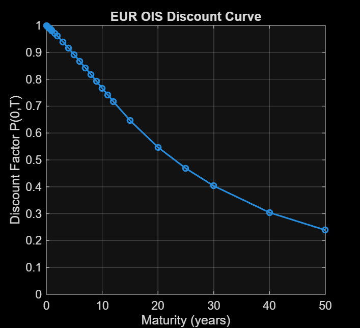
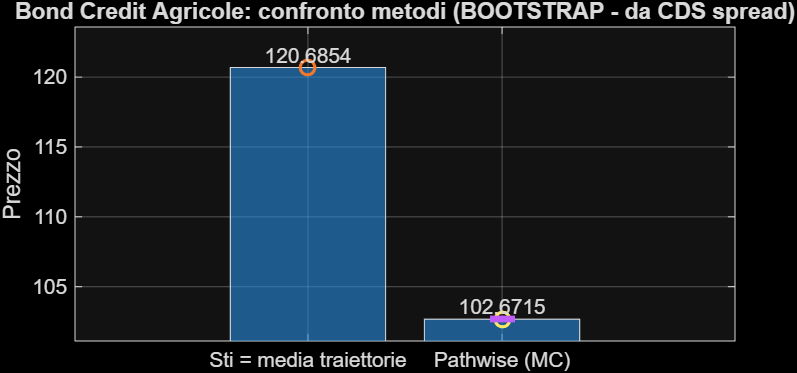

# Advanced Derivatives Market Analysis

University group coursework in **derivatives pricing, implied volatility, model-free volatility, interest-rate curve construction and credit-equity structured-product valuation**, implemented in MATLAB.

The original assignment was completed by a **four-person team**, including me. This public portfolio version preserves the submitted MATLAB code and analytical outputs without rewriting the underlying coursework. Raw Bloomberg-derived input files and Bloomberg Terminal screenshots are intentionally excluded.

## Scope

The project covers eight linked exercises built around EURO STOXX 50 options, VSTOXX, EUR OIS, Euribor and Crédit Agricole credit data:

1. **Static no-arbitrage diagnostics** — Merton bounds, monotonicity and discrete convexity on option mid prices, with bid-ask-aware tolerance checks.
2. **Implied-volatility modelling and Black-Scholes pricing** — quadratic regression of total implied volatility on OTM calls and evaluation at the target strike.
3. **Monte Carlo option pricing** — 20,000-path European-call valuation and confidence intervals, benchmarked against Black-Scholes.
4. **One-maturity VSTOXX approximation** — OTM option aggregation under the simplified classroom formula requested in the assignment.
5. **EURO STOXX 50 / VSTOXX dependence** — leverage-effect diagnostics and a Vasicek-style OLS calibration on log-return dynamics.
6. **Euribor distribution modelling** — Normal and Variance-Gamma fits to Euribor 3M changes/log-returns.
7. **EUR OIS curve construction** — recursive discount-factor bootstrap and continuously compounded zero rates.
8. **Callable credit-equity-linked bond pricing** — 20,000-path risk-neutral equity simulation, OIS discounting, survival/default modelling and comparison of mean-path versus pathwise trigger evaluation.

## Selected results

- Target-strike implied volatility: approximately **13.36%**.
- Black-Scholes price at `K = 5753`: approximately **94.22**.
- Monte Carlo call price with test volatility `σ = 7%`: approximately **55.0**, consistent with Black-Scholes at the same volatility.
- One-maturity VSTOXX estimate: approximately **12.69** versus an observed value near **15.04** on the valuation date.
- EURO STOXX 50 / VSTOXX log-return correlation: approximately **-0.79**, consistent with a strong leverage-effect pattern.
- Pathwise callable-bond valuation: approximately **102.65–102.67**, versus approximately **120.65–120.69** under the approximation based on the average simulated index path.

## Selected figures

### Option prices and implied volatility


### Black-Scholes and Monte Carlo


### Equity-volatility dependence


### EUR OIS term structure




### Callable bond




## Repository structure

```text
.
├── matlab/
│   ├── BSPrice.m
│   ├── esercizio_I.m
│   ├── esercizio_II.m
│   ├── esercizio_III.m
│   ├── esercizio_IV.m
│   ├── esercizio_V.m
│   ├── esercizio_VI.m
│   ├── esercizio_VII.m
│   └── esercizio_VIII.m
├── data/
│   └── README.md
├── figures/
├── .gitignore
└── README.md
```

## Methodological notes

- The quadratic volatility step is a **quadratic regression fit** on OTM-call total volatility. Because the target strike lies just below the OTM-call subset used in the submitted code, the target evaluation is technically a short extrapolation rather than a strict interpolation. The original coursework code is preserved unchanged.
- The one-maturity VSTOXX calculation is the simplified classroom construction requested by the assignment; it is not presented as a replication of the full production VSTOXX methodology.
- The Vasicek-style OLS section should be read primarily as an AR(1)/Euler persistence exercise on log returns. Coefficients close to zero indicate low one-step persistence; the repository does not interpret this as evidence of weak mean-reversion speed.
- The OIS bootstrap uses simplified tenor/day-count mappings and log-linear interpolation of discount factors at missing intermediate payment dates, as documented in the submitted report.
- In the callable-bond exercise, the GBM drift uses a constant risk-free input derived from the one-month OIS zero rate, while the full bootstrapped OIS curve is used for discounting.
- The bond triggers depend on `S(t_i)/S(t_0)`. Therefore the different numerical `S(t_0)` source used in Exercise VIII does not affect the simulated trigger ratios because the GBM paths scale proportionally with the same initial value.

## Data and report policy

The full submitted report is not redistributed here because it contains Bloomberg Terminal screenshots and third-party market-data displays. The public repository instead includes the unchanged MATLAB source code and selected generated analytical figures that are sufficient to understand the modelling workflow and the principal results.

## Authorship

The original coursework was completed by a four-person university team. GitHub publication under this account reflects portfolio curation and does **not** imply sole authorship of the underlying assignment.

## Scope disclaimer

This is academic coursework. It is not presented as a production pricing library, trading strategy or live investment-performance record.
